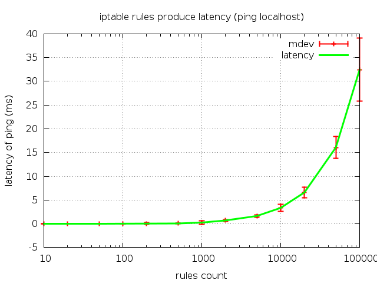

.. iptables-optimizer documentation master file, created by
   sphinx-quickstart on Fri Aug 30 20:47:16 2013.
   You can adapt this file completely to your liking, but it should at least
   contain the root `toctree` directive.

Welcome to iptables-optimizer's documentation!
==============================================

what's up here?
===============

**iptables-optimizer** is a python script called from a shell wrapper, which
sorts your iptables-chains in relation to packet counters. The intention is
to run it by cron as often as needed.

**iptables-optimizer** is licensed under GNU GPLv3 or any later version

Contents:

.. toctree::
   :maxdepth: 2

   iptables-optimizer
   plausible
   unittests
   sources

Indices and tables
==================

* :ref:`genindex`
* :ref:`modindex`
* :ref:`search`

